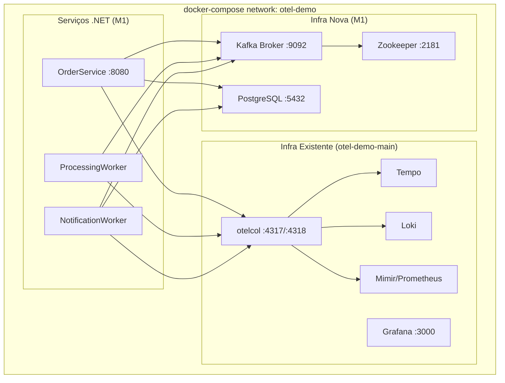

# Docker Compose Infrastructure — Design

**Spec**: `.specs/features/docker-compose-infra/spec.md`
**Status**: Draft

---

## Architecture Overview

O `docker-compose.yaml` existente já define a stack LGTM (Grafana, Loki, Tempo, Mimir) e o OTel Collector. A extensão adiciona os blocos de infra de mensageria e banco, mais os 3 serviços da PoC, todos na mesma rede `otel-demo`.



---

## Code Reuse Analysis

### Existing Components to Leverage

| Component | Location | How to Use |
|-----------|----------|------------|
| Rede Docker `otel-demo` | `docker-compose.yaml` | Referenciar o mesmo network nos novos serviços |
| Serviço `otelcol` | `docker-compose.yaml` | Reutilizar endpoint `otelcol:4317` nas vars de ambiente dos serviços .NET |
| `otelcol.yaml` | `otelcol.yaml` | Sem modificação — já aceita OTLP gRPC na porta 4317 |
| Processors de sampling | `processors/sampling/` | Sem modificação — já descartam health checks |

### Integration Points

| System | Integration Method |
|--------|--------------------|
| OTel Collector existente | Serviços .NET apontam `OTEL_EXPORTER_OTLP_ENDPOINT=http://otelcol:4317` |
| Rede Docker existente | Novos serviços adicionam `networks: [otel-demo]` |

---

## Components

### Bloco Zookeeper

- **Purpose**: Coordenação de cluster Kafka (requerido pelo Kafka clássico)
- **Location**: `docker-compose.yaml` — serviço `zookeeper`
- **Interfaces**: Porta interna `2181`
- **Dependencies**: Nenhuma
- **Reuses**: Imagem oficial `confluentinc/cp-zookeeper`

### Bloco Kafka Broker

- **Purpose**: Message broker da PoC para os fluxos assíncronos que serão implementados a partir de M2
- **Location**: `docker-compose.yaml` — serviço `kafka`
- **Interfaces**: Porta interna `9092` (PLAINTEXT)
- **Dependencies**: `zookeeper`
- **Reuses**: Imagem oficial `confluentinc/cp-kafka`
- **Configurações-chave**:
  - `KAFKA_ADVERTISED_LISTENERS: PLAINTEXT://kafka:9092`
  - `KAFKA_AUTO_CREATE_TOPICS_ENABLE: "true"` — tópicos criados automaticamente na primeira publicação

### Bloco PostgreSQL

- **Purpose**: Persistência relacional para `OrderService` e `NotificationWorker`
- **Location**: `docker-compose.yaml` — serviço `postgres`
- **Interfaces**: Porta interna `5432`
- **Dependencies**: Nenhuma
- **Reuses**: Imagem oficial `postgres:16-alpine`
- **Configurações-chave**: `POSTGRES_DB`, `POSTGRES_USER`, `POSTGRES_PASSWORD` via variáveis

### Bloco OrderService

- **Purpose**: API HTTP base da PoC, inicializando corretamente no Compose e enviando telemetria para o collector
- **Location**: `docker-compose.yaml` — serviço `order-service` + `src/OrderService/Dockerfile`
- **Interfaces**: Porta `8080` mapeada para o host
- **Dependencies**: `kafka`, `postgres`, `otelcol`
- **Reuses**: Rede `otel-demo` existente

### Bloco ProcessingWorker

- **Purpose**: Worker background base da PoC, inicializando corretamente no Compose e pronto para receber a lógica de consumo em M2
- **Location**: `docker-compose.yaml` — serviço `processing-worker` + `src/ProcessingWorker/Dockerfile`
- **Interfaces**: Sem porta exposta (worker puro)
- **Dependencies**: `kafka`, `otelcol`
- **Reuses**: Rede `otel-demo` existente

### Bloco NotificationWorker

- **Purpose**: Worker background base da PoC, inicializando corretamente no Compose e pronto para receber a lógica de persistência/notificação em M2
- **Location**: `docker-compose.yaml` — serviço `notification-worker` + `src/NotificationWorker/Dockerfile`
- **Interfaces**: Sem porta exposta (worker puro)
- **Dependencies**: `kafka`, `postgres`, `otelcol`
- **Reuses**: Rede `otel-demo` existente

---

## Data Models

### Variáveis de Ambiente Padronizadas (por serviço .NET)

| Variável | Valor padrão no Compose | Consumer |
|----------|------------------------|----------|
| `OTEL_EXPORTER_OTLP_ENDPOINT` | `http://otelcol:4317` | Todos os 3 |
| `OTEL_SERVICE_NAME` | `order-service` / `processing-worker` / `notification-worker` | Cada um |
| `KAFKA_BOOTSTRAP_SERVERS` | `kafka:9092` | Todos os 3 |
| `POSTGRES_CONNECTION_STRING` | `Host=postgres;Database=otelpoc;Username=poc;Password=poc` | `OrderService`, `NotificationWorker` |

### Health Check Pattern (Postgres)

```yaml
healthcheck:
  test: ["CMD-SHELL", "pg_isready -U poc -d otelpoc"]
  interval: 5s
  timeout: 5s
  retries: 10
```

### Health Check Pattern (Kafka)

```yaml
healthcheck:
  test: ["CMD", "kafka-broker-api-versions", "--bootstrap-server", "localhost:9092"]
  interval: 10s
  timeout: 10s
  retries: 10
```

---

## Dockerfile Pattern (Multi-Stage)

Cada serviço .NET seguirá o mesmo padrão:

```dockerfile
# Stage 1: Build
FROM mcr.microsoft.com/dotnet/sdk:10.0 AS build
WORKDIR /src
COPY . .
RUN dotnet publish -c Release -o /app/publish

# Stage 2: Runtime
FROM mcr.microsoft.com/dotnet/aspnet:10.0 AS runtime
WORKDIR /app
COPY --from=build /app/publish .
ENTRYPOINT ["dotnet", "<ServiceName>.dll"]
```
