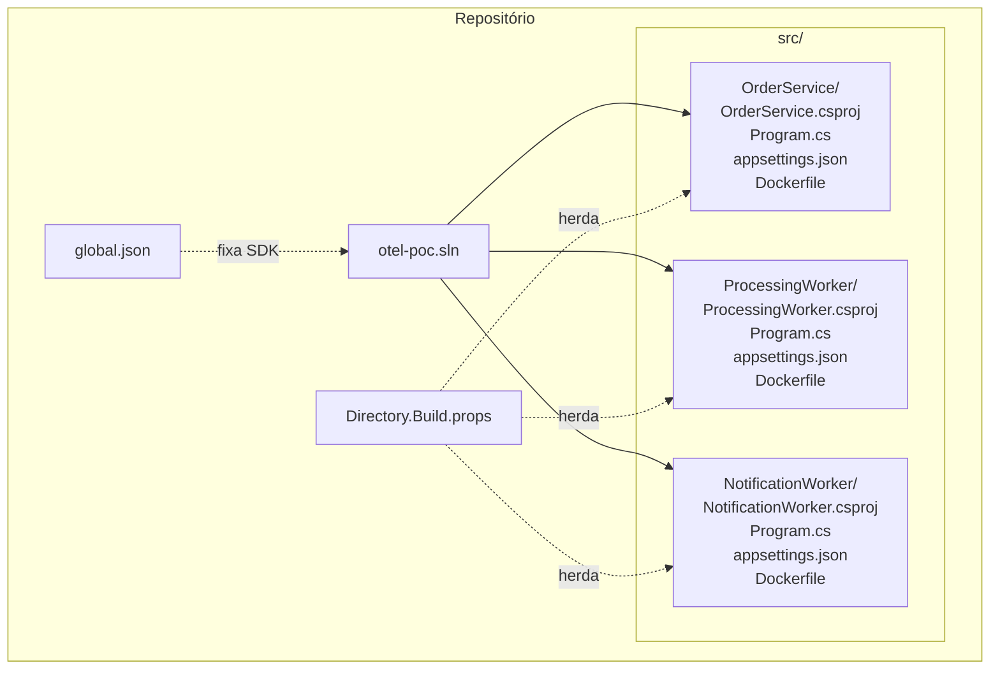

# .NET Solution — Design

**Spec**: `.specs/features/dotnet-solution/spec.md`
**Status**: Draft

---

## Architecture Overview

Estrutura de solution .NET 10 com 3 projetos na pasta `src/`, um `global.json` para pinagem do SDK, um `Directory.Build.props` na raiz para configuração compartilhada de build e Dockerfiles individuais por projeto.



---

## Code Reuse Analysis

### Existing Components to Leverage

| Component | Location | How to Use |
|-----------|----------|------------|
| Dockerfiles pattern | `.specs/features/docker-compose-infra/design.md` | Replicar o padrão multi-stage definido no design de infra |

### Integration Points

| System | Integration Method |
|--------|--------------------|
| `docker-compose.yaml` (feature docker-compose-infra) | Os `Dockerfile` gerados aqui são referenciados pelo `build: context` do Compose |

---

## Components

### otel-poc.sln

- **Purpose**: Arquivo de solution que agrupa os 3 projetos para build e restore unificados
- **Location**: `otel-poc.sln` (raiz do repositório)
- **Interfaces**: `dotnet build otel-poc.sln`, `dotnet restore otel-poc.sln`
- **Dependencies**: Nenhuma
- **Reuses**: N/A

### Directory.Build.props

- **Purpose**: Centralizar propriedades e referências de pacotes comuns a todos os projetos
- **Location**: `Directory.Build.props` (raiz do repositório, ao lado do `.sln`)
- **Interfaces**: Herdado automaticamente pelo MSBuild — sem referência explícita nos `.csproj`
- **Dependencies**: Nenhuma
- **Reuses**: N/A
- **Conteúdo mínimo**:
  - `<TargetFramework>net10.0</TargetFramework>`
  - `<Nullable>enable</Nullable>`
  - `<ImplicitUsings>enable</ImplicitUsings>`
  - `<TreatWarningsAsErrors>false</TreatWarningsAsErrors>` (flexível para PoC)
  - Versões de pacotes OTel como `<PackageVersion>` para uso nos `.csproj`

### global.json

- **Purpose**: Fixar a versão do SDK usada localmente e no CI para evitar variações entre ambientes
- **Location**: `global.json` (raiz do repositório)
- **Interfaces**: `dotnet --version`, `dotnet build`
- **Dependencies**: Nenhuma
- **Reuses**: Convenção padrão do ecossistema .NET para pinagem de SDK

### OrderService (projeto Minimal API)

- **Purpose**: Esqueleto de Minimal API HTTP para validar startup, configuração e instrumentação base em M1
- **Location**: `src/OrderService/`
- **Interfaces**: HTTP em porta 8080 (configurado no `Program.cs`)
- **Dependencies**: `Directory.Build.props`
- **Reuses**: Template `dotnet new webapi` simplificado para o estilo Minimal API

### ProcessingWorker (projeto Worker Service)

- **Purpose**: Esqueleto de workers background — sem consumer Kafka real (M2)
- **Location**: `src/ProcessingWorker/`
- **Interfaces**: Nenhuma porta exposta
- **Dependencies**: `Directory.Build.props`
- **Reuses**: Template `dotnet new worker`

### NotificationWorker (projeto Worker Service)

- **Purpose**: Esqueleto de worker background — sem consumer Kafka real (M2)
- **Location**: `src/NotificationWorker/`
- **Interfaces**: Nenhuma porta exposta
- **Dependencies**: `Directory.Build.props`
- **Reuses**: Template `dotnet new worker`

---

## Data Models

### Directory.Build.props — Estrutura

```xml
<Project>
  <PropertyGroup>
    <TargetFramework>net10.0</TargetFramework>
    <Nullable>enable</Nullable>
    <ImplicitUsings>enable</ImplicitUsings>
  </PropertyGroup>

  <ItemGroup>
    <!-- Versões centralizadas — referenciadas nos .csproj com Version="$(OtelVersion)" -->
    <PackageReference Update="OpenTelemetry.Extensions.Hosting"        Version="1.9.0" />
    <PackageReference Update="OpenTelemetry.Exporter.OpenTelemetryProtocol" Version="1.9.0" />
    <PackageReference Update="OpenTelemetry.Instrumentation.AspNetCore" Version="1.9.0" />
    <PackageReference Update="OpenTelemetry.Instrumentation.Http"       Version="1.9.0" />
  </ItemGroup>
</Project>
```

### OrderService.csproj — Estrutura mínima

```xml
{
  "sdk": {
    "version": "10.0.100"
  }
}
```

### OrderService.csproj — Estrutura mínima

```xml
<Project Sdk="Microsoft.NET.Sdk.Web">
  <PropertyGroup>
    <!-- TargetFramework herdado do Directory.Build.props -->
  </PropertyGroup>
  <ItemGroup>
    <PackageReference Include="OpenTelemetry.Extensions.Hosting" />
    <PackageReference Include="OpenTelemetry.Exporter.OpenTelemetryProtocol" />
    <PackageReference Include="OpenTelemetry.Instrumentation.AspNetCore" />
    <PackageReference Include="OpenTelemetry.Instrumentation.Http" />
  </ItemGroup>
</Project>
```

### ProcessingWorker.csproj / NotificationWorker.csproj — Estrutura mínima

```xml
<Project Sdk="Microsoft.NET.Sdk.Worker">
  <PropertyGroup>
    <!-- TargetFramework herdado do Directory.Build.props -->
  </PropertyGroup>
  <ItemGroup>
    <PackageReference Include="OpenTelemetry.Extensions.Hosting" />
    <PackageReference Include="OpenTelemetry.Exporter.OpenTelemetryProtocol" />
    <PackageReference Include="OpenTelemetry.Instrumentation.Http" />
  </ItemGroup>
</Project>
```

### Dockerfile Pattern (aplicado aos 3 projetos)

```dockerfile
# Stage 1: Build
FROM mcr.microsoft.com/dotnet/sdk:10.0 AS build
WORKDIR /src
COPY ["global.json", "./"]
COPY ["Directory.Build.props", "./"]
COPY ["src/<ProjectName>/<ProjectName>.csproj", "src/<ProjectName>/"]
RUN dotnet restore "src/<ProjectName>/<ProjectName>.csproj"
COPY . .
WORKDIR "/src/src/<ProjectName>"
RUN dotnet publish -c Release -o /app/publish --no-restore

# Stage 2: Runtime
FROM mcr.microsoft.com/dotnet/aspnet:10.0 AS runtime
WORKDIR /app
COPY --from=build /app/publish .
ENTRYPOINT ["dotnet", "<ProjectName>.dll"]
```

> **Nota sobre o Dockerfile**: O build deve usar contexto na raiz do repositório para que `global.json`, `Directory.Build.props` e `src/<ProjectName>` estejam disponíveis no `COPY`.
