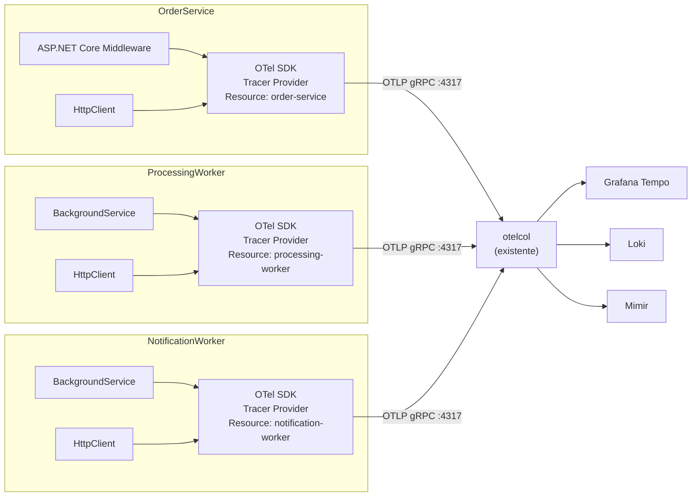

# OpenTelemetry Bootstrap — Design

**Spec**: `.specs/features/otel-bootstrap/spec.md`
**Status**: Draft

---

## Architecture Overview

A configuração OTel é feita no `Program.cs` de cada serviço via método de extensão. Os traces são exportados via OTLP gRPC para o `otelcol` existente, que já está configurado para receber na porta 4317 e encaminhar para Tempo, Loki e Mimir.



---

## Code Reuse Analysis

### Existing Components to Leverage

| Component | Location | How to Use |
|-----------|----------|------------|
| OTel Collector config | `otelcol.yaml` | Sem modificação — já possui receiver OTLP gRPC em `:4317` |
| Processor `drop-health-checks` | `processors/sampling/drop-health-checks.yaml` | Já configurado no pipeline do collector — health checks serão automaticamente descartados |
| `Directory.Build.props` | `Directory.Build.props` (gerado em `dotnet-solution`) | Versões dos pacotes OTel já centralizadas lá |
| Variáveis de ambiente | `docker-compose.yaml` (gerado em `docker-compose-infra`) | `OTEL_EXPORTER_OTLP_ENDPOINT` e `OTEL_SERVICE_NAME` já definidos |

### Integration Points

| System | Integration Method |
|--------|--------------------|
| OTel Collector (`otelcol`) | OTLP gRPC exporters nos 3 serviços apontam para `otelcol:4317` |
| `Directory.Build.props` | Pacotes OTel referenciados sem versão nos `.csproj` |
| Variável `OTEL_SERVICE_NAME` | Lida pelo SDK OTel para o `service.name` do Resource |

---

## Components

### OtelExtensions (por projeto)

- **Purpose**: Encapsular a configuração do `TracerProvider` (e futuramente `MeterProvider`/`LoggerProvider`) em um método de extensão limpo
- **Location**: `src/OrderService/Extensions/OtelExtensions.cs`, `src/ProcessingWorker/Extensions/OtelExtensions.cs`, `src/NotificationWorker/Extensions/OtelExtensions.cs`
- **Interfaces**:
  - `AddOtelInstrumentation(this IServiceCollection services, IConfiguration config): IServiceCollection`
- **Dependencies**: `OpenTelemetry.Extensions.Hosting`, `OpenTelemetry.Exporter.OpenTelemetryProtocol`, instrumentações específicas
- **Reuses**: Padrão de configuração recomendado pelo SDK OTel .NET

### Program.cs (OrderService)

- **Purpose**: Registrar o OTel via método de extensão; chamar `AddOtelInstrumentation()`
- **Location**: `src/OrderService/Program.cs`
- **Interfaces**: N/A (entry point)
- **Dependencies**: `OtelExtensions`
- **Reuses**: `Program.cs` gerado pelo template `webapi`

### Program.cs (ProcessingWorker / NotificationWorker)

- **Purpose**: Registrar o OTel via método de extensão para workers
- **Location**: `src/ProcessingWorker/Program.cs`, `src/NotificationWorker/Program.cs`
- **Interfaces**: N/A (entry point)
- **Dependencies**: `OtelExtensions`
- **Reuses**: `Program.cs` gerado pelo template `worker`

---

## Data Models

### OtelExtensions — Implementação de referência (OrderService)

```csharp
using OpenTelemetry.Resources;
using OpenTelemetry.Trace;

namespace OrderService.Extensions;

public static class OtelExtensions
{
    public static IServiceCollection AddOtelInstrumentation(
        this IServiceCollection services,
        IConfiguration config)
    {
        var serviceName    = config["OTEL_SERVICE_NAME"]    ?? "order-service";
        var serviceVersion = config["OTEL_SERVICE_VERSION"] ?? "0.0.0";
        var otlpEndpoint   = config["OTEL_EXPORTER_OTLP_ENDPOINT"] ?? "http://localhost:4317";

        services.AddOpenTelemetry()
            .WithTracing(builder => builder
                .SetResourceBuilder(ResourceBuilder.CreateDefault()
                    .AddService(serviceName, serviceVersion: serviceVersion))
                .AddAspNetCoreInstrumentation()   // apenas no OrderService
                .AddHttpClientInstrumentation()
                .AddOtlpExporter(opt =>
                {
                    opt.Endpoint = new Uri(otlpEndpoint);
                    opt.Protocol = OpenTelemetry.Exporter.OtlpExportProtocol.Grpc;
                }));

        return services;
    }
}
```

> **Workers**: mesma estrutura sem `AddAspNetCoreInstrumentation()`.

### Program.cs — Uso (OrderService)

```csharp
var builder = WebApplication.CreateBuilder(args);
builder.Services.AddOtelInstrumentation(builder.Configuration);
// ... demais configurações
var app = builder.Build();
app.Run();
```

### Program.cs — Uso (Workers)

```csharp
var builder = Host.CreateApplicationBuilder(args);
builder.Services.AddOtelInstrumentation(builder.Configuration);
// ... demais configurações
await builder.Build().RunAsync();
```

---

## Notas de Implementação

- **`OTEL_SERVICE_NAME`** pode ser lido diretamente pelo SDK OTel .NET via `OTEL_*` env vars padrão se o pacote `OpenTelemetry.Extensions.Hosting` estiver configurado com `UseEnvironmentVariables()`. Verificar se o SDK aceita automaticamente — se sim, simplificar a extensão.
- **Health check filter**: O processor `drop-health-checks.yaml` já existe no `otelcol`. Confirmar qual path o template `webapi` expõe (por padrão `/healthz` ou `/health`) e validar que o filtro cobre esse path.
- **Versão `1.9.0`** dos pacotes OTel: em produção usar versão estável mais recente compatível com .NET 10. As versões serão gerenciadas pelo `Directory.Build.props`.
