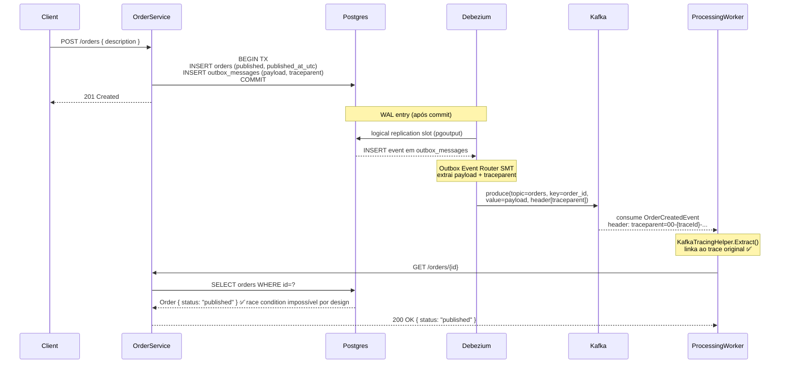

# Transaction Outbox — CDC + Debezium Outbox Event Router Design

**Spec**: `.specs/features/transaction-outbox/spec.md`
**Status**: Approved

---

## Architecture Overview

O padrão **Transactional Outbox com CDC** usa o Postgres WAL (Write-Ahead Log) como fonte de eventos. O `OrderService` salva o pedido e a mensagem de outbox na mesma transação. O **Debezium** lê o WAL via logical replication e, usando o **Outbox Event Router SMT**, publica o payload no Kafka topic `orders` propagando o `traceparent` como header — garantindo rastreabilidade end-to-end sem código extra na aplicação.



### Por que a race condition é impossível por design

O CDC lê o WAL **somente após o commit** da transação. Isso significa que quando o Debezium publica no Kafka, o Postgres já tem `orders.status = 'published'` e `published_at_utc` preenchidos — é uma garantia estrutural do banco de dados, não depende de lógica de aplicação ou ordenação de operações.

---

## Code Reuse Analysis

### Existing Components to Leverage

| Component | Location | How to Use |
|---|---|---|
| `OrderDbContext` | `src/OrderService/Data/OrderDbContext.cs` | Adicionar `DbSet<OutboxMessage>` + mapping |
| `OrderCreatedEvent` | `src/OrderService/Contracts/OrderCreatedEvent.cs` | Serializar como `payload` da outbox — sem alteração |
| `OrderStatuses` | `src/OrderService/Data/OrderStatuses.cs` | Reaproveitar `Published` no INSERT direto |
| `EnsureDatabaseSchemaAsync` | `src/OrderService/Program.cs` | Adicionar DDL da tabela `outbox_messages` |
| `KafkaTracingHelper` | `src/OrderService/Messaging/KafkaTracingHelper.cs` | Ler `Activity.Current?.Id` para preencher `traceparent` na outbox |
| `W3CTraceContext` | `src/Shared/W3CTraceContext.cs` | Referência para entender formato do traceparent (`activity.Id`) |

### Components Removed / Simplified

| Component | Status | Motivo |
|---|---|---|
| `IKafkaOrderPublisher` + `KafkaOrderPublisher` | **Removido do endpoint** | O `POST /orders` deixa de publicar Kafka; Debezium assume essa responsabilidade |
| `IProducer<string, string>` singleton | **Removido do DI** | Não há mais produção direta de Kafka pelo OrderService |
| `OutboxRelayWorker` | **Não criado** | CDC substitui o relay worker |
| Relay metrics (`outbox.relay.*`) | **Não criado** | Sem relay worker, não há métricas de relay |

### Integration Points

| Sistema | Ponto de integração |
|---|---|
| Postgres WAL | Habilitar `wal_level=logical` via parâmetro de startup do container |
| Debezium Kafka Connect | Novo container `kafka-connect`, imagem `debezium/connect:3.0` |
| Conector Postgres | Config JSON registrada via REST API do Kafka Connect no startup |
| Kafka topic `orders` | Mesmo topic — Debezium publica com `order_id` como chave e `traceparent` como header |

---

## Components

### `OutboxMessage` (nova entidade)

- **Purpose**: Representa uma mensagem a ser publicada via CDC. Uma vez inserida e commitada, o Debezium assume a publicação.
- **Location**: `src/OrderService/Data/OutboxMessage.cs` (arquivo novo)
- **Data Model**:

```csharp
public sealed class OutboxMessage
{
    public Guid Id { get; set; }              // PK — Debezium usa como event.id
    public Guid OrderId { get; set; }         // Kafka message key (aggregate_id)
    public string Payload { get; set; }       // JSON de OrderCreatedEvent (Kafka value)
    public string AggregateType { get; set; } // "Order" — convenção Debezium EventRouter
    public string EventType { get; set; }     // "OrderCreated"
    public string IdempotencyKey { get; set; }// = OrderId.ToString() — UNIQUE constraint
    public string? Traceparent { get; set; }  // W3C traceparent → header Kafka
    public string? Tracestate { get; set; }   // W3C tracestate → header Kafka
    public DateTimeOffset CreatedAtUtc { get; set; }
}
```

**Importante**: Não há coluna `status` — a outbox CDC é append-only. Uma vez inserida, a mensagem é responsabilidade do Debezium. O estado de publicação vive no Kafka Connect offset storage.

- **Reuses**: Padrão de `Order.cs`

---

### `OrderDbContext` (atualização)

- **Purpose**: Expor `DbSet<OutboxMessage>` e mapear a tabela `outbox_messages`
- **Location**: `src/OrderService/Data/OrderDbContext.cs`
- **Changes**:
  - `public DbSet<OutboxMessage> OutboxMessages => Set<OutboxMessage>();`
  - OnModelCreating: `ToTable("outbox_messages")`, mapear todas as colunas, `HasIndex(e => e.IdempotencyKey).IsUnique()`

---

### `POST /orders` endpoint (refatoração)

- **Purpose**: Salvar `Order` (status=`published`) + `OutboxMessage` na mesma TX; remover toda publicação Kafka
- **Location**: `src/OrderService/Program.cs`
- **Changes**:
  - Remover `IKafkaOrderPublisher publisher` dos parâmetros
  - Remover o `IProducer<string, string>` do DI em `builder.Services`
  - Um único bloco `try`:
    - `await using var tx = await dbContext.Database.BeginTransactionAsync()`
    - `dbContext.Orders.Add(order)` com `Status = Published`, `PublishedAtUtc = now`
    - Criar `OutboxMessage` com payload serializado + `Traceparent = Activity.Current?.Id`
    - `dbContext.OutboxMessages.Add(outboxMessage)`
    - `await dbContext.SaveChangesAsync()`
    - `await tx.CommitAsync()`
  - Em caso de falha: retornar `500` com `PersistFailed`
  - Retornar `201 Created`
- **Removes**: Bloco de `PublishAsync`, segundo `SaveChangesAsync` de status update, `OrderCreateResults.PublishFailed`, `OrderCreateResults.StatusUpdateFailed`

---

### `EnsureDatabaseSchemaAsync` (extensão)

- **Purpose**: Criar tabela `outbox_messages` no startup
- **Location**: `src/OrderService/Program.cs`
- **DDL**:

```sql
CREATE TABLE IF NOT EXISTS outbox_messages (
    id uuid PRIMARY KEY,
    order_id uuid NOT NULL,
    payload text NOT NULL,
    aggregate_type text NOT NULL DEFAULT 'Order',
    event_type text NOT NULL DEFAULT 'OrderCreated',
    idempotency_key text NOT NULL,
    traceparent text NULL,
    tracestate text NULL,
    created_at_utc timestamp with time zone NOT NULL
);

CREATE UNIQUE INDEX IF NOT EXISTS uix_outbox_messages_idempotency_key
    ON outbox_messages (idempotency_key);

CREATE INDEX IF NOT EXISTS ix_outbox_messages_created
    ON outbox_messages (created_at_utc DESC);
```

**Nota**: Sem índice em `status` — não há coluna de status na outbox CDC.

---

### Debezium Connector Config (novo arquivo)

- **Purpose**: Configuração do conector Debezium PostgreSQL com Outbox Event Router SMT
- **Location**: `tools/debezium/order-outbox-connector.json`
- **Config**:

```json
{
  "name": "order-outbox-connector",
  "config": {
    "connector.class": "io.debezium.connector.postgresql.PostgresConnector",
    "database.hostname": "postgres",
    "database.port": "5432",
    "database.user": "poc",
    "database.password": "poc",
    "database.dbname": "otelpoc",
    "plugin.name": "pgoutput",
    "publication.autocreate.mode": "filtered",
    "table.include.list": "public.outbox_messages",
    "topic.prefix": "dbz",
    "transforms": "outbox",
    "transforms.outbox.type": "io.debezium.transforms.outbox.EventRouter",
    "transforms.outbox.table.field.event.id": "id",
    "transforms.outbox.table.field.event.key": "order_id",
    "transforms.outbox.table.field.event.payload": "payload",
    "transforms.outbox.route.by.field": "aggregate_type",
    "transforms.outbox.route.topic.replacement": "orders",
    "transforms.outbox.table.fields.additional.placement": "traceparent:header:traceparent,tracestate:header:tracestate"
  }
}
```

**Key field**: `transforms.outbox.table.fields.additional.placement` — instrui o Debezium a pegar a coluna `traceparent` da tabela e injetá-la como header `traceparent` na mensagem Kafka. O `KafkaTracingHelper.Extract` do `ProcessingWorker` já lê esse header.

---

### `docker-compose.yaml` (extensão)

**Postgres** — adicionar parâmetro WAL:
```yaml
postgres:
  command: ["postgres",
    "-c", "wal_level=logical",
    "-c", "max_replication_slots=5",
    "-c", "max_wal_senders=5"]
```

**kafka-connect** — novo serviço:
```yaml
kafka-connect:
  image: debezium/connect:3.0
  ports:
    - "8083:8083"
  environment:
    BOOTSTRAP_SERVERS: kafka:9092
    GROUP_ID: "1"
    CONFIG_STORAGE_TOPIC: connect_configs
    OFFSET_STORAGE_TOPIC: connect_offsets
    STATUS_STORAGE_TOPIC: connect_statuses
  depends_on:
    kafka:
      condition: service_healthy
    postgres:
      condition: service_healthy
  healthcheck:
    test: ["CMD-SHELL", "curl -sf http://localhost:8083/connectors || exit 1"]
    interval: 10s
    timeout: 5s
    retries: 10
    start_period: 30s
  networks:
    - otel-demo
```

**connector-init** — container de registro automático:
```yaml
connector-init:
  image: curlimages/curl:latest
  depends_on:
    kafka-connect:
      condition: service_healthy
  volumes:
    - ./tools/debezium/order-outbox-connector.json:/connector.json:ro
  command: >
    sh -c "curl -sf -X POST http://kafka-connect:8083/connectors
    -H 'Content-Type: application/json'
    -d @/connector.json &&
    echo 'Connector registered successfully'"
  networks:
    - otel-demo
```

---

## Trace Propagation Detail

```
POST /orders
  Activity.Current.Id = "00-abc123traceId-spanId1-01"
  └─ outbox_messages.traceparent = "00-abc123traceId-spanId1-01"
       │
       │  [Debezium lê WAL → Outbox Event Router SMT]
       │
       ▼
  Kafka message header: traceparent = "00-abc123traceId-spanId1-01"
       │
       │  [ProcessingWorker consume]
       │  KafkaTracingHelper.Extract() → ActivityContext { traceId = abc123 }
       │  ActivitySource.StartActivity("kafka consume orders", Consumer, parentContext)
       │
       ▼
  span "kafka consume orders"  → mesmo traceId = abc123
       └─ span "GET /orders/{id}"  → mesmo traceId = abc123
```

O Grafana monta o waterfall completo pelo `traceId` compartilhado, mesmo que a publicação Kafka tenha sido feita pelo Debezium (processo externo à aplicação).

---

## Decisões de Design

| Decisão | Escolha | Justificativa |
|---|---|---|
| Variante do Outbox | CDC (Debezium) | Garantia estrutural do WAL: impossível publicar antes do commit |
| Sem coluna `status` na outbox | Append-only | CDC é one-shot; o estado de entrega vive no Kafka Connect offsets |
| `orders.status` direto em `published` | Sem `pending_publish` no happy path | Com outbox garantido, o status intermediário não agrega valor |
| Trace propagation | Coluna `traceparent` + SMT | `KafkaTracingHelper.Extract` já lê o header `traceparent` — zero mudança no worker |
| `ProcessingWorker` preservado | Sem alteração | Mantém HTTP call para trace rico no PoC |
| Registro do conector | `connector-init` container | Zero script manual; idempotente via `POST /connectors` |

| Component | Location | How to Use |
|---|---|---|
| `OrderDbContext` | `src/OrderService/Data/OrderDbContext.cs` | Adicionar `DbSet<OutboxMessage>` + mapping em `OnModelCreating` |
| `KafkaOrderPublisher` / `IKafkaOrderPublisher` | `src/OrderService/Messaging/` | Reusar integralmente no relay worker — sem alteração |
| `OrderCreatedEvent` | `src/OrderService/Contracts/OrderCreatedEvent.cs` | Serializar como payload da outbox; deserializar no relay |
| `OrderStatuses` | `src/OrderService/Data/OrderStatuses.cs` | Reaproveitar constante `Published` na atualização do relay |
| `EnsureDatabaseSchemaAsync` | `src/OrderService/Program.cs` | Adicionar DDL da tabela `outbox_messages` |
| `ActivitySourceHolder` / `OtelExtensions` | `src/OrderService/Extensions/OtelExtensions.cs` | Adicionar Meter do relay ao `.WithMetrics()` |
| `IOrderMetrics` / `OrderMetrics` | `src/OrderService/Metrics/OrderMetrics.cs` | Adicionar contadores e histograma do relay |
| `KafkaTracingHelper` | `src/OrderService/Messaging/KafkaTracingHelper.cs` | Reusar injeção de trace context no header Kafka |

### Integration Points

| Sistema | Ponto de integração |
|---|---|
| Postgres (EF Core) | Nova tabela `outbox_messages`; transação compartilhada com `orders` |
| Kafka | Apenas o `OutboxRelayWorker` publica — endpoint `POST /orders` deixa de publicar |
| OTel Collector | Spans e métricas do relay exportados via OTLP existente |

---

## Components

### `OutboxStatus` (nova classe de constantes)

- **Purpose**: Constantes de status válidos para `outbox_messages`
- **Location**: `src/OrderService/Data/OutboxStatus.cs`
- **Interface**: `public const string Pending`, `Published`, `Failed`
- **Dependencies**: Nenhuma
- **Reuses**: Segue mesmo padrão de `OrderStatuses.cs`

---

### `OutboxMessage` (nova entidade)

- **Purpose**: Representa uma mensagem pendente de publicação no Kafka
- **Location**: `src/OrderService/Data/OutboxMessage.cs`
- **Data Model**:

```csharp
public sealed class OutboxMessage
{
    public Guid Id { get; set; }           // PK
    public Guid OrderId { get; set; }      // FK lógica para orders.id
    public string Payload { get; set; }    // JSON de OrderCreatedEvent
    public string Status { get; set; }     // pending | published | failed
    public string IdempotencyKey { get; set; } // = OrderId.ToString() (UNIQUE)
    public DateTimeOffset CreatedAtUtc { get; set; }
    public DateTimeOffset? PublishedAtUtc { get; set; }
    public string? ErrorMessage { get; set; }
}
```

- **Dependencies**: `OutboxStatus`
- **Reuses**: Segue mesmo padrão de `Order.cs`

---

### `OrderDbContext` (atualização)

- **Purpose**: Expor `DbSet<OutboxMessage>` e mapear a tabela `outbox_messages`
- **Location**: `src/OrderService/Data/OrderDbContext.cs`
- **Changes**:
  - Adicionar `public DbSet<OutboxMessage> OutboxMessages => Set<OutboxMessage>();`
  - Adicionar configuração em `OnModelCreating`: tabela `outbox_messages`, chave primária `id`, colunas mapeadas, índice em `status`, constraint UNIQUE em `idempotency_key`
- **Reuses**: Padrão fluent API idêntico ao mapeamento de `Order`

---

### `POST /orders` endpoint (refatoração)

- **Purpose**: Salvar `Order` + `OutboxMessage` atomicamente; remover chamada direta ao Kafka
- **Location**: `src/OrderService/Program.cs`
- **Changes**:
  - Remover `IKafkaOrderPublisher publisher` dos parâmetros do endpoint
  - Substituir bloco de `PublishAsync` + `UpdateStatus` por: serializar `OrderCreatedEvent`, criar `OutboxMessage`, adicionar ao contexto, salvar tudo em uma transação EF Core
  - Manter `OrderCreateResults.Created` para sucesso; `PersistFailed` para falha de transação
  - Remover `OrderCreateResults.PublishFailed` e `StatusUpdateFailed` do path da requisição (tornam-se responsabilidade do relay)
- **Reuses**: `OrderDbContext`, `OrderStatuses`, `JsonSerializer`

---

### `OutboxRelayWorker` (novo BackgroundService)

- **Purpose**: Poleia `outbox_messages` pendentes, publica no Kafka e commita estado final atomicamente
- **Location**: `src/OrderService/Messaging/OutboxRelayWorker.cs`
- **Interface**: `ExecuteAsync(CancellationToken)` herdado de `BackgroundService`
- **Loop**:

```
LOOP:
  1. Criar scope IServiceProvider
  2. Buscar outbox_messages WHERE status='pending' ORDER BY created_at LIMIT batchSize
  3. Para cada mensagem:
     a. Deserializar payload → OrderCreatedEvent
     b. PublishAsync via IKafkaOrderPublisher (span kafka publish)
     c. BEGIN TRANSACTION:
        - outbox_messages.status = 'published', published_at_utc = now()
        - orders.status = 'published', published_at_utc = now()
        COMMIT
     d. Em caso de erro: outbox_messages.status = 'failed', error_message = ex.Message; COMMIT
  4. Aguardar pollInterval ms
```

- **Dependencies**: `IServiceScopeFactory`, `IKafkaOrderPublisher`, `IConfiguration`, `ILogger<OutboxRelayWorker>`, `IOrderMetrics`
- **Reuses**: `IKafkaOrderPublisher`, `OrderDbContext`, `OrderStatuses`, `OutboxStatus`, `JsonSerializerOptions`

---

### `OrderMetrics` (extensão)

- **Purpose**: Adicionar contadores e histograma para o relay
- **Location**: `src/OrderService/Metrics/OrderMetrics.cs`
- **New members**:
  - `Counter<long>` → `outbox.relay.published.total` (tag: nenhuma)
  - `Counter<long>` → `outbox.relay.failed.total` (tag: nenhuma)
  - `Histogram<double>` → `outbox.relay.duration` em ms
- **New method**: `RecordRelayResult(string result, TimeSpan duration)` com `result` ∈ `{published, failed}`
- **Reuses**: `_meter` existente, padrão `RecordCreateResult`

---

### `EnsureDatabaseSchemaAsync` (extensão)

- **Purpose**: Criar tabela `outbox_messages` no startup se não existir
- **Location**: `src/OrderService/Program.cs`
- **DDL a adicionar**:

```sql
CREATE TABLE IF NOT EXISTS outbox_messages (
    id uuid PRIMARY KEY,
    order_id uuid NOT NULL,
    payload text NOT NULL,
    status text NOT NULL DEFAULT 'pending',
    idempotency_key text NOT NULL,
    created_at_utc timestamp with time zone NOT NULL,
    published_at_utc timestamp with time zone NULL,
    error_message text NULL
);

CREATE UNIQUE INDEX IF NOT EXISTS uix_outbox_messages_idempotency_key
    ON outbox_messages (idempotency_key);

CREATE INDEX IF NOT EXISTS ix_outbox_messages_status_created
    ON outbox_messages (status, created_at_utc)
    WHERE status = 'pending';
```

- **Reuses**: Bloco `ExecuteSqlRawAsync` existente

---

### `appsettings.json` (extensão)

- **Purpose**: Configuração do relay com defaults razoáveis
- **Location**: `src/OrderService/appsettings.json`
- **New section**:

```json
"OutboxRelay": {
  "PollIntervalMs": 500,
  "BatchSize": 10
}
```

---

## Fluxo de Estado

```
POST /orders          OutboxRelayWorker       Postgres orders     outbox_messages
─────────────         ─────────────────       ───────────────     ───────────────
INSERT (tx)     →                             pending_publish     pending
                  publish Kafka (ok)
                  UPDATE (tx)         →       published           published
                  publish Kafka (fail)
                  UPDATE (tx)         →       pending_publish     failed
```

---

## Decisões de Design

| Decisão | Escolha | Justificativa |
|---|---|---|
| Variante do Outbox | Polling Publisher | Zero infraestrutura nova; suficiente para PoC de instância única |
| SKIP LOCKED | Não implementado (P2) | PoC roda instância única; adicionar quando necessário |
| Retry de `failed` | Não implementado (P3) | Fora do escopo atual; mensagens `failed` são observáveis via span/log |
| Enriquecimento do evento | Não alterado | `OrderCreatedEvent` mantém contrato atual; não impacta `ProcessingWorker` |
| Escopo do relay | Dentro do `OrderService` | Sem novo projeto, sem nova infraestrutura |
| Transação EF Core | `IDbContextTransaction` explícita | Garantia de atomicidade Kafka + DB update |
